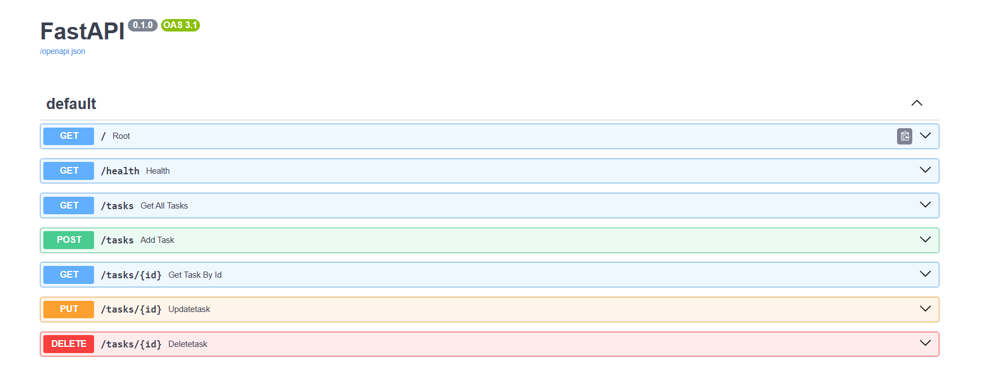
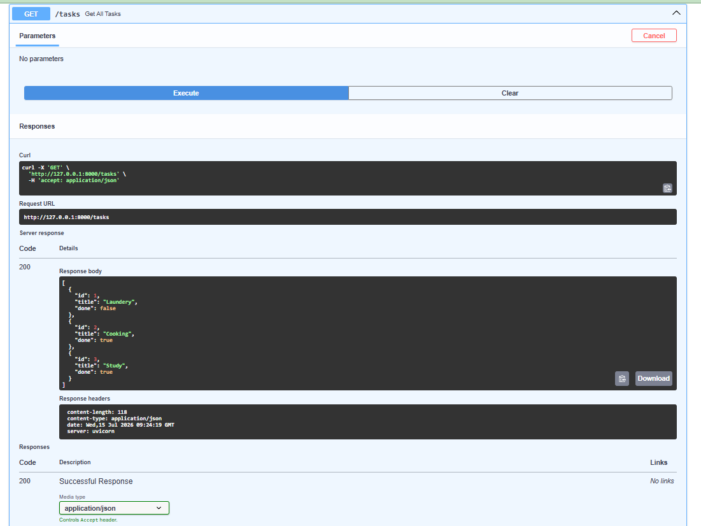

# 📋 Task API — First CRUD Application

A simple task management REST API built with **FastAPI (Python)**. This project implements full **CRUD** (Create, Read, Update, Delete) operations with in-memory storage, automatic Swagger UI documentation, and professional HTTP status codes.

---

## 🚀 Quick Start — Run in Under 5 Minutes

### Prerequisites
- Python 3.7 or higher
- pip (Python package manager)
- Git

---

### Step 1 — Clone the Repository

```bash
git clone https://github.com/Amna-223/Assignment-01-First-CRUD-API.git
cd Assignment-01-First-CRUD-API
```

### Step 2 — Create & Activate Virtual Environment

```bash
python -m venv venv
```

```bash
# Windows (PowerShell)
venv\Scripts\activate

# Mac / Linux
source venv/bin/activate
```

### Step 3 — Install Dependencies

```bash
pip install fastapi uvicorn
```

### Step 4 — Run the Server

```bash
uvicorn main:app --reload
```

### Step 5 — Access the API

| Interface | URL |
|---|---|
| API Base URL | http://localhost:8000 |
| Swagger UI (Interactive Docs) | http://localhost:8000/docs |

---

## 📚 API Endpoints

| Method | Endpoint | Description | Request Body | Status Codes |
|---|---|---|---|---|
| GET | `/` | API info (name, version, endpoints) | None | 200 |
| GET | `/health` | Health check — confirms server is alive | None | 200 |
| GET | `/tasks` | Get all tasks | None | 200 |
| GET | `/tasks/{id}` | Get a single task by ID | None | 200, 404 |
| POST | `/tasks` | Create a new task | `{"title": "string"}` | 201, 400 |
| PUT | `/tasks/{id}` | Update an existing task | `{"title": "string", "done": boolean}` | 200, 400, 404 |
| DELETE | `/tasks/{id}` | Delete a task | None | 204, 404 |

---

## 🧪 Sample curl Commands

> **Windows PowerShell users:** use `curl.exe` instead of `curl`, and pass JSON via a file:
> ```powershell
> echo '{"title":"Buy milk"}' > data.json
> curl.exe -i -X POST http://localhost:8000/tasks -H "Content-Type: application/json" -d "@$PWD\data.json"
> ```

### GET — API Info
```bash
curl -i http://localhost:8000/
```

### GET — Health Check
```bash
curl -i http://localhost:8000/health
```

### GET — All Tasks
```bash
curl -i http://localhost:8000/tasks
```

### GET — Single Task by ID
```bash
curl -i http://localhost:8000/tasks/1
```

### POST — Create a New Task
```bash
curl -i -X POST http://localhost:8000/tasks \
  -H "Content-Type: application/json" \
  -d '{"title": "Buy milk"}'
```

### PUT — Update a Task
```bash
curl -i -X PUT http://localhost:8000/tasks/1 \
  -H "Content-Type: application/json" \
  -d '{"title": "Buy eggs", "done": true}'
```

### DELETE — Delete a Task
```bash
curl -i -X DELETE http://localhost:8000/tasks/1
```

---

## 📄 Sample curl -i Output

**Request:**
```bash
curl -i -X POST http://localhost:8000/tasks \
  -H "Content-Type: application/json" \
  -d '{"title": "Buy milk"}'
```

**Response:**
```
HTTP/1.1 201 Created
date: Wed, 15 Jul 2026 08:22:49 GMT
server: uvicorn
content-length: 40
content-type: application/json

{"id":4,"title":"Buy milk","done":false}
```

**404 Example (task not found):**
```
HTTP/1.1 404 Not Found
server: uvicorn
content-type: application/json

{"detail":"Task not found"}
```

**204 Example (task deleted):**
```
HTTP/1.1 204 No Content
server: uvicorn
```

---

## 🖼️ Swagger UI Screenshot

FastAPI automatically generates interactive API documentation — no extra setup needed.

Visit **http://localhost:8000/docs** to explore and test all endpoints directly in your browser.





---

## ✅ Full CRUD Summary

| Operation | Method | Endpoint | Notes |
|---|---|---|---|
| **Create** | POST | `/tasks` | `title` required; `done` defaults to `false`; returns 201 |
| **Read (all)** | GET | `/tasks` | Returns full task list |
| **Read (one)** | GET | `/tasks/{id}` | Returns 404 if ID not found |
| **Update** | PUT | `/tasks/{id}` | Send `title` and/or `done`; returns updated task |
| **Delete** | DELETE | `/tasks/{id}` | Returns 204 No Content on success |

---
⭐ Extras

📊 Stats Endpoint

A bonus endpoint that makes the server compute something rather than just return stored data.

Endpoint: GET /stats

bashcurl -i http://localhost:8000/stats

Response:

HTTP/1.1 200 OK
content-type: application/json

{"total": 3, "done": 2, "open": 1}

FieldMeaningtotalTotal number of tasksdoneTasks marked as done: trueopenTasks still pending (done: false)


💀 The Mortality Experiment

I created several new tasks via POST, confirmed they appeared in GET /tasks, then restarted the server. After restart, GET /tasks returned only the 3 original hardcoded tasks — every task I had added was gone.

This happens because this API uses in-memory storage — the chores list lives in RAM, which is wiped every time the Python process stops. There is no database writing anything to disk, so nothing survives a restart. This is exactly why databases exist, and exactly what Week 3 is about.


## 📁 Project Structure

```
Assignment-01-First-CRUD-API/
├── main.py                  # FastAPI app — all endpoints
├── data.json                # Test data file for curl (Windows)
├── swagger-screenshot.png   # Swagger UI screenshot
├── venv/                    # Virtual environment (not tracked by Git)
├── .gitignore               # Git ignore rules
└── README.md                # This file
```

---

## 🛠️ Tech Stack

| Tool | Purpose |
|---|---|
| **FastAPI** | Python web framework |
| **Uvicorn** | ASGI server |
| **Pydantic** | Request body validation |
| **Swagger UI** | Auto-generated interactive docs |
| **Git + GitHub** | Version control & publishing |

---

## 🧠 Author

**Amna** — [GitHub Profile](https://github.com/Amna-223)

---

## 📄 License

This project is for learning purposes — feel free to use, modify, and share.